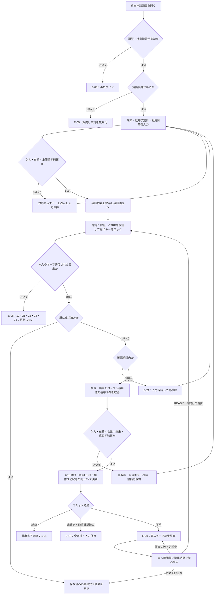
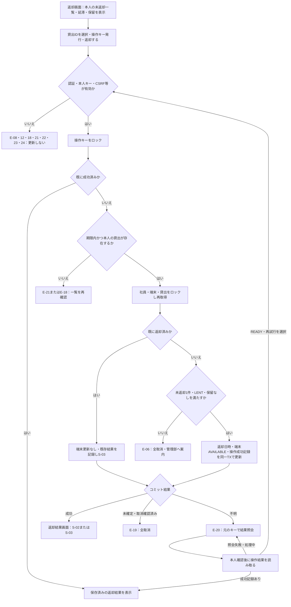

# Gate5 PC貸出・返却機能 要件定義書（例外系補完版）

版：1.0 ／ 作成日：2026-09-18 ／ 文書状態：実装前の仕様案

本書は、Gate1「2. 要件定義書 v1.2」の章立てと、R・V・N形式の採番を踏襲した仕様書である。Gate5で求めるバリデーション一覧、業務ルール、エラーメッセージ、状態遷移表を本文にまとめ、例外系洗い出し表と補完後のフロー図を付す。本書の作成は、システムの実装・試験完了を意味しない。

## 0. 参照資料と仕様の位置付け

| 資料 | 使用箇所 |
|---|---|
| Gate1_配布資料_粒度100.pdf、4～9ページ | 要件定義書の構成、データ定義表、遷移表、R・V・N採番、メッセージ表の形式 |
| Gate5_配布資料_粒度70.pdf、4～6ページ | 正常系、元の3テーブル、入力項目、画面フロー |
| 同資料、7～13ページ | 8観点、例外20項目以上、4点の仕様書、フロー図、実装優先度、提出画像 |
| Gate5_配布資料_貸出台帳の抜粋.pdf、1～2ページ | 未返却の重複、社員の在籍状況、返却・延滞に関する具体例 |
| Gate5_配布資料_端末マスタと棚卸の結果.pdf、1～3ページ | 端末状態、実物との不一致、手作業修正の記録不足 |

**区分の読み方**：「配布」は配布仕様を引き継ぐ内容、「補完」は本課題で不足を埋めるために本書が決めた内容を表す。配布資料のチェックリストや記入例は、それだけで確定した業務ルールとは扱わない。

### 0.1 今回の補完判断

| No | 今回決めた仕様（補完） | 決定理由 |
|---|---|---|
| D-01 | 貸出対象はLAPTOPのみ。1人の未返却貸出は最大1台 | 共用ノートPCという対象範囲と、占有・同時申請の判断基準を明確にする |
| D-02 | 返却予定日は貸出確定日の翌日～90日後、両端を含む | Gate5のひな形の期間を採用。当日、過去日、91日後以降は不可 |
| D-03 | 土日・祝日も返却予定日に指定できる | 休業日カレンダーが配布されていないため。ひな形の「休業日は不可」は今回は採用しない |
| D-04 | 新規貸出はACTIVEのみ。本人の既存貸出の返却はLEAVE・RETIREDでも許可 | 新規貸出の制限と、未返却を解消する処理を分ける |
| D-05 | 延滞は返却予定日の翌日0時から。延滞中も返却可能で、新規貸出は不可 | 回収を妨げず、延滞を表示できるようにする |
| D-06 | 業務日付・表示時刻はAsia/Tokyo。日時はDB内でUTCに統一 | 日またぎとクライアント時計のずれで判定を変えない |
| D-07 | 確認内容はサーバー保存し、有効期限は30分。成功した操作記録は本課題では削除しない | すり替え、連打、応答消失後の再実行を防ぐ |
| D-08 | 既存データの矛盾や棚卸差異がある端末は利用保留にし、自動修正しない | 正しい借用者や返却日時を資料だけでは断定できない |
| D-09 | 社員本人の認証済みセッションを前提とする。ログイン機構の新規開発は対象外 | user_idをリクエストの自己申告で決めない。研修用認証でもサーバー側の本人識別は必要 |

## 1. 状況設定

正常系だけ記載されたPC貸出処理に、入力ミス、利用不可状態、同時実行、途中失敗、不正操作への対応を追加する。目的は、端末・貸出記録・利用者の対応が壊れず、利用者が結果と次の操作を理解できること。

対象は貸出申請、確認、貸出確定、本人の返却、完了表示である。予約、承認、延長、通知メール、修理・廃棄の管理画面、管理者の代理返却画面は対象外。既存不整合の調査・訂正は運用対応とし、通常の貸出・返却で上書きしない。

## 2. 要件定義書 v1.0

### 2.1 概要

| 項目 | 内容 |
|---|---|
| 機能名 | PC貸出・返却処理 |
| 対象ユーザー | 社員本人。新規貸出は在籍中の社員 |
| 目的 | 二重貸出と更新不整合を防止し、端末と借用者を追跡可能にする |
| 正常系 | 貸出申請 → 確認 → 貸出完了／返却画面 → 返却完了 |
| 例外系 | 付録Aの40項目、8観点すべてを対象に設計 |
| 優先度 | 高＝データ不整合・重複・不正更新、中＝業務違反・入力不備、低＝表示・操作補助 |

### 2.2 用語定義

| 用語 | 定義 |
|---|---|
| 端末 | devicesの1行。資産番号で識別される実機1台 |
| 未返却貸出 | lendings.returned_atがNULLの貸出記録 |
| 貸出可能 | LAPTOP、AVAILABLE、未返却0件、利用保留なしをすべて満たす状態 |
| 延滞 | 未返却かつdue_dateがサーバーの業務日付より前であること |
| 利用保留 | 不整合・棚卸差異の調査中として貸出と通常返却を停止すること。devices.statusとは別に管理 |
| 操作キー | サーバーが発行するランダムな一意キー。同じ操作の再送を識別する |
| トランザクション | 複数の更新をすべて確定するか、すべて取り消す処理単位 |
| 検知時点 | 画面初期表示、確認画面への進行時、貸出／返却の確定時、結果照会時のいずれか |

### 2.3 データ定義

元の3テーブルの名称・カラム・型・状態コードは配布仕様を維持する。NULL、デフォルト、外部キー、一意制約、追加テーブルは本書で補完する。数値IDと、資料中のL-001・E-1011等の表示用コードを同一視しない。取り込み時には対応表を用意する。

#### devices（端末）テーブル

| カラム名 | 型 | NULL | デフォルト | 説明 |
|---|---|---|---|---|
| id | BIGINT | NO | AUTO | 主キー |
| asset_no | VARCHAR(20) | NO | なし | 資産番号。一意 |
| model_name | VARCHAR(50) | NO | なし | 機種名 |
| device_type | VARCHAR(20) | NO | なし | LAPTOP / TABLET / MONITOR |
| status | VARCHAR(20) | NO | AVAILABLE | AVAILABLE / LENT / REPAIR / DISPOSED |
| purchased_at | DATE | NO | なし | 購入日 |

#### lendings（貸出）テーブル

| カラム名 | 型 | NULL | デフォルト | 説明 |
|---|---|---|---|---|
| id | BIGINT | NO | AUTO | 主キー |
| device_id | BIGINT | NO | なし | devices.idへの外部キー |
| user_id | BIGINT | NO | なし | employees.idへの外部キー。認証済み本人から設定 |
| lent_at | DATETIME | NO | 確定時刻 | 貸出日時。サーバーが設定 |
| due_date | DATE | NO | なし | 日本時間での返却予定日 |
| returned_at | DATETIME | YES | NULL | 返却日時。サーバーが設定 |
| purpose | VARCHAR(100) | NO | なし | 前後空白除去後1～100文字の利用目的 |

#### employees（社員）テーブル

| カラム名 | 型 | NULL | デフォルト | 説明 |
|---|---|---|---|---|
| id | BIGINT | NO | AUTO | 主キー |
| name | VARCHAR(50) | NO | なし | 氏名 |
| department | VARCHAR(50) | NO | なし | 部署名 |
| employment_status | VARCHAR(20) | NO | なし | ACTIVE / LEAVE / RETIRED |

#### operation_requests（操作・確認内容）テーブル【補完・追加】

| カラム名 | 型 | NULL | デフォルト | 説明 |
|---|---|---|---|---|
| request_key | VARCHAR(43) | NO | サーバー発行 | 主キー。32バイトの安全な乱数をBase64URL・パディングなしで符号化 |
| user_id | BIGINT | NO | なし | 本人の社員ID。外部キー |
| operation | VARCHAR(10) | NO | なし | LEND / RETURN |
| payload_json | TEXT | NO | なし | LENDはdevice_id・due_date・トリム後purpose、RETURNはlending_id。正規化した確認済み内容 |
| status | VARCHAR(10) | NO | READY | READY / SUCCEEDED |
| created_at | DATETIME | NO | 現在日時 | 発行日時 |
| expires_at | DATETIME | NO | 発行30分後 | READYの実行期限 |
| result_lending_id | BIGINT | YES | NULL | 成功した貸出ID。外部キー |
| result_json | TEXT | YES | NULL | 成功時点の資産番号・予定日・返却日時等。再表示用 |
| completed_at | DATETIME | YES | NULL | 成功確定時刻 |

貸出確認時／返却画面の操作準備時にREADYを保存する。成功時に貸出・端末更新と同じトランザクションでSUCCEEDEDにする。失敗時はREADYのまま。処理途中の成功記録は作らない。READYの期限判定は「現在日時 < expires_at」を有効とする。SUCCEEDEDは期限経過後も本人に結果を再表示し、更新を再実行しない。

#### device_holds（利用保留）テーブル【補完・追加】

| カラム名 | 型 | NULL | デフォルト | 説明 |
|---|---|---|---|---|
| device_id | BIGINT | NO | なし | 主キー、devices.idへの外部キー |
| reason | VARCHAR(200) | NO | なし | 二重未返却、棚卸差異、台帳不整合等の根拠 |
| held_at | DATETIME | NO | 現在日時 | 保留登録日時 |
| released_at | DATETIME | YES | NULL | 調査・訂正後の解除日時。NULLなら有効 |

保留の登録・解除は端末をロックして行う。専用管理画面は作らず、根拠・担当者・修正前後・修正日時を運用記録に残す。棚卸結果をアプリが自動で知ることはできないため、配布資料で判明している差異を事前登録する。

#### データ整合性の制約【補完】

- 未返却貸出は端末ごとに最大1件。`returned_at IS NULL`の行についてdevice_idに一意制約を設ける（部分一意索引、または使用DBで同等の制約）。
- 1人1台は社員行の排他制御と未返却件数の再確認で守る。既存の複数貸出は削除せず、新規貸出を止めて返却で解消する。
- AVAILABLE・REPAIR・DISPOSEDは未返却0件、LENTは未返却1件を正常とする。件数・状態が矛盾する端末では通常更新を拒否する。
- 外部キーの連鎖削除は禁止。貸出履歴を持つ社員・端末を物理削除しない。返却日時は貸出日時以上とする。
- 配布台帳には重複が存在するため、一意制約の導入前に付録Bの隔離・調査を行う。不整合を含む原本へそのまま制約を適用できるとは想定しない。

### 2.4 ステータスの定義と遷移

| コード | 表示名 | 意味 |
|---|---|---|
| AVAILABLE | 貸出可能 | 貸出用の在庫。利用保留があれば選択不可 |
| LENT | 貸出中 | 未返却貸出が1件ある |
| REPAIR | 修理中 | メーカー等へ修理依頼中。貸出不可 |
| DISPOSED | 廃棄済み | 廃棄済み。貸出不可 |

**本機能での遷移可能な組み合わせ（○以外は更新不可）**

| 変更前 ＼ 変更後 | AVAILABLE | LENT | REPAIR | DISPOSED |
|---|---|---|---|---|
| AVAILABLE | ― | ○：貸出確定 | × | × |
| LENT | ○：本人の返却 | ― | × | × |
| REPAIR | × | × | ― | × |
| DISPOSED | × | × | × | ― |

「―」は変更なしであり、新しい貸出や返却の登録を許す意味ではない。○でも、本人・在籍・入力・未返却件数・利用保留などの条件をすべて確認する。修理完了や廃棄登録の遷移は別業務であり、この貸出・返却機能からは許可しない。既に返却済みの貸出への再送は端末の現在状態を変えず、既存結果を表示する。

### 2.5 ステータス変更に伴う付随処理

| 操作・遷移 | 同じトランザクションで行う処理 | 成功時 |
|---|---|---|
| 貸出：AVAILABLE → LENT | 最終チェック → lendingsを1件作成（lent_at＝処理基準時刻、returned_at＝NULL）→ devicesを条件付き更新 → 操作キーをSUCCEEDEDに更新 | コミット後のみ貸出完了を表示 |
| 返却：LENT → AVAILABLE | 本人の未返却1件を確認 → returned_atを処理基準時刻に更新 → devicesを条件付き更新 → 操作キーをSUCCEEDEDに更新 | コミット後のみ返却完了を表示 |
| 成功済み操作キーの再送 | 本人・操作種別・保存内容の一致を確認し、保存済み結果を読む。業務データは更新しない | 元の完了結果を表示 |
| 別操作キーで返却済み貸出を再送 | 本人の返却済み記録を読み、端末は変更しない。操作キーに既存結果を保存 | S-03を表示 |
| いずれかの更新失敗 | 貸出・端末・操作成功記録のすべてをロールバック | E-19。結果が不明ならE-20として照会 |

返却済みの貸出を再送した時点で、その端末を別の社員が借りていても、新しい貸出や端末状態には触れない。

### 2.6 貸出・返却の業務ルール

| No | ルール | 検知時点 | 優先度 | 対応例外 |
|---|---|---|---|---|
| R-01 | 貸出候補はLAPTOPかつAVAILABLEかつ未返却0件かつ保留なし。表示後に変化し得るため確定時にも再取得する | 初期表示・確認・貸出確定 | 高 | X-01～08 |
| R-02 | 新規貸出は社員レコードが存在しACTIVEの場合のみ | 確認・貸出確定 | 中 | X-09～11 |
| R-03 | 未返却上限は1人1台。社員行をロックして件数を再確認する | 確認・貸出確定 | 高 | X-12、14 |
| R-04 | 機種選択欄は「機種名（資産番号）」を表示し、実機のdevice_idを送信する。同じ機種の別端末を自動代替しない | 画面表示・確認 | 中 | X-01、05、06 |
| R-05 | 同一端末の貸出競合は先に確定した1件だけ成功する。後続はE-02。AVAILABLE確認だけをロック外で行ってはならない | 貸出確定 | 高 | X-02、13 |
| R-06 | 確認内容を本人・操作キーに紐付けて保存する。確定要求はキーとCSRFトークンのみを受け付け、別の業務値を指定した要求は拒否する | 確認・貸出／返却確定 | 高 | X-15、16、35～38、40 |
| R-07 | 全入力をサーバーで検証する。期限内の確認内容でも貸出確定日に日付範囲を再判定する | 確認・貸出確定 | 中 | X-17～24、30 |
| R-08 | 利用目的は前後のUnicode空白を除去して保存。空白のみ不可、1～100 Unicodeコードポイント。絵文字・日本語・HTML風文字列も文字データとして扱う | 確認・表示 | 中 | X-22～24 |
| R-09 | 借用者IDは認証情報から取得し、入力項目にしない。返却・結果照会は本人の貸出だけ許可する | すべての保護された処理 | 高 | X-11、25、34、36、40 |
| R-10 | 返却対象は貸出IDで指定し、端末IDだけで現在の貸出を推測して更新しない。返却済みなら再更新しない | 返却確定 | 高 | X-25、26 |
| R-11 | LEAVE・RETIREDでも認証済み本人の返却は許可。アカウント停止でログイン不能なら管理部へ返却を依頼し、別の管理手順で記録する | 返却画面・返却確定 | 中 | X-09、10、28 |
| R-12 | 延滞は予定日翌日0時から。端末状態はLENTのまま。「延滞」と予定日を表示し、新規貸出は拒否する | 画面表示・貸出確定 | 中 | X-28～30 |
| R-13 | 複数テーブル更新と操作成功記録は1トランザクション。途中で失敗した場合は何も確定させない | 貸出／返却確定 | 高 | X-31、32 |
| R-14 | 通信断で結果不明の場合、新しいキーで自動再実行しない。元のキーで結果照会または同じ要求を再送し、SUCCEEDEDなら完了表示する | 応答失敗・結果照会 | 高 | X-15、16、33、34 |
| R-15 | 状態と未返却件数の不整合・重複がある端末は貸出も通常返却も拒否する。推測で貸出記録を削除したり返却済みにしない | 初期表示・各確定 | 高 | X-07、08、27 |
| R-16 | 棚卸差異のある端末は利用保留にする。実物が棚にあっても返却日時を自動補完しない。調査結果・訂正前後・担当者を記録してから解除する | 初期データ準備・運用 | 高 | X-08、27 |
| R-17 | この機能に任意のstatus更新APIを設けない。修理・廃棄への変更要求は拒否する | 不正な更新要求 | 高 | X-27、39 |
| R-18 | 確認キーが未発行・期限切れなら再確認を求める。期限ちょうどは無効。成功済みキーは期限で成功結果を失わない | 確定・結果照会 | 中 | X-16、35、38 |
| R-19 | クライアント指定の貸出・返却時刻、状態、user_idは採用しない。更新APIでは許可されていない項目を拒否する | 各更新要求 | 高 | X-36、37、39 |
| R-20 | 更新はPOSTのみ。GETによるページ閲覧・再読込では貸出・返却を実行しない。更新時にはCSRFチェックを行う | 各更新要求 | 高 | X-35、39、40 |

#### 競合を防ぐ確定処理の順番

1. 認証・CSRF・要求形式を検証し、操作キーが本人のものか確認する。
2. トランザクションを開始し、操作キー → 社員 → 端末 → 貸出の順でロックする。使用DBで行ロックがない場合は、同じ不変条件を満たす書き込み直列化を行う。
3. 操作がSUCCEEDEDなら業務更新せず既存結果を返す。READYは期限・保存内容を検証する。
4. ロック取得後に処理基準時刻を1回取得し、日付、在籍状態、未返却件数、対象所有者、利用保留、端末状態を最新値で再判定する。
5. 新規貸出では延滞 → 上限台数の順に判定する。返却では本人確認 → 返却済み判定 → 保留・整合性・状態の順とし、返却済み記録は現在端末を更新しない。
6. 2.5の更新を実行する。端末の条件付き更新、未返却の返却更新は各1行が対象であることを確認する。一意制約違反・更新件数不一致はロールバックする。
7. コミット成功後に完了画面へ遷移する。コミット結果が分からない場合は「失敗して未登録」と断定せず、操作キーで確定結果を照会する。

ロック待ち上限は5秒とする（補完）。タイムアウト時はE-19を返し、入力を保持する。社員の在籍状態変更や保留登録も同じロック対象を使い、並行更新で検証をすり抜けさせない。端末競合の一意制約違反は再読込後、通常の競合ならE-02、既存不整合ならE-06へ振り分ける。

### 2.7 画面仕様

#### 貸出申請画面

```text
PC貸出申請
借用者：認証済み本人の氏名（変更不可）
機種        [ノートA（PC-0001） ▼]
返却予定日  [YYYY-MM-DD]
利用目的    [                                  ]
            項目エラーを該当欄の直下に表示
業務エラー・案内を画面上部に表示
                                      [貸出する]
```

#### 確認画面

機種名・資産番号・本人氏名・返却予定日・トリム後の利用目的を表示する。「戻って修正」「確定」を設け、戻って修正した場合は新しい確認キーを発行し、以前のREADYキーを無効化する。成功済みキーの履歴は消さない。期限の無効化はexpires_atを現在以前に設定する。

#### 返却画面

本人の未返却一覧に資産番号、機種名、貸出日時、返却予定日、延滞表示を示す。利用保留中の記録も隠さず「管理部に確認してください」と表示し、返却ボタンを無効化する。返却対象は貸出IDで識別する。

#### 表示ルール

| No | ルール |
|---|---|
| V-01 | 貸出候補はR-01の条件で絞り、asset_noの昇順で表示する。貸出不可端末を選択可能にしない |
| V-02 | 候補0件ならE-05を表示し、プルダウンと「貸出する」を無効化する |
| V-03 | LEAVE・RETIREDは新規貸出ボタンを無効にしてE-07。本人の返却操作は利用可能にする |
| V-04 | 返却予定日・利用目的の入力エラーは欄の直下に赤文字で表示し、最初の不正欄へフォーカスする |
| V-05 | 業務エラーは画面上部に赤い通知領域で表示。入力値は保持し、無効となった端末選択だけ解除して候補を再取得する |
| V-06 | 「確定」「返却する」は送信開始から応答まで無効化して「処理中…」と表示する。サーバー側の重複防止も必須 |
| V-07 | 完了画面はコミット済み結果から表示する。リロード・戻る操作で再登録しない |
| V-08 | 延滞は色だけでなく「延滞（返却予定日：YYYY/MM/DD）」を表示する。返却ボタンは延滞だけを理由に無効化しない |
| V-09 | 未返却0件ならI-01を表示し、返却ボタンを表示しない |
| V-10 | 結果不明時はE-20と「結果を確認する」を表示し、新規申請へ誘導しない。元の操作キーを保持する |
| V-11 | 認証切れはE-08を表示して再ログインへ誘導する。再ログイン後、本人の操作結果を確認できる |
| V-12 | 利用目的・氏名・機種名はHTMLとして解釈せずエスケープして表示。スクリプトやタグを実行しない |
| V-13 | エラーの色に加え本文を表示し、読み上げ通知に対応する。DBエラーや内部SQLを画面に出さない |

### 2.8 処理結果メッセージ

文言は句読点まで本表と一致させる。`{資産番号}`等は保存された値で置換し、日付表示はYYYY/MM/DD。入力欄が複数不正なら全欄のエラーを同時に表示する。認証・CSRF・所有者の検証を先に行い、権限のない対象の詳細を表示しない。

| ID | 状況・検知時点 | メッセージ文言 | 表示種別・場所 |
|---|---|---|---|
| S-01 | 貸出コミット成功・同一操作再送 | {資産番号} を貸し出しました。返却予定日は {返却予定日} です。 | 成功（緑）・貸出完了画面 |
| S-02 | 返却コミット成功・同一操作再送 | {資産番号} を返却しました。 | 成功（緑）・返却完了画面 |
| S-03 | 本人の貸出が既に返却済み | この貸出は既に返却済みです。追加の更新は行っていません。 | 案内・返却結果画面 |
| I-01 | 返却画面で本人の未返却0件 | 現在借りている端末はありません。 | 案内・一覧領域 |
| E-01 | 選択端末が存在しない／確認・確定時 | 選択した端末は存在しません。端末を選び直してください。 | エラー（赤）・上部 |
| E-02 | 選択後の貸出競合・貸出中／確定時 | この端末は現在貸出中です。別の端末を選択してください。 | エラー（赤）・申請画面上部 |
| E-03 | 修理中・廃棄済み／確認・確定時 | この端末は修理中または廃棄済みのため、貸出できません。 | エラー（赤）・上部 |
| E-04 | LAPTOP以外／確認・確定時 | この端末は貸出対象のノートPCではありません。 | エラー（赤）・上部 |
| E-05 | 貸出可能0件／初期表示・候補再取得時 | 現在貸出可能な端末はありません。時間をおいて再度確認してください。 | 案内・選択欄付近 |
| E-06 | 保留・状態と台帳の不整合／確定時 | この端末は記録の確認が必要なため、操作できません。管理部に連絡してください。 | エラー（赤）・上部 |
| E-07 | 新規貸出者がLEAVE・RETIRED／確認・確定時 | 在籍中の社員のみ新規貸出を利用できます。 | エラー（赤）・上部 |
| E-08 | 認証切れ・社員レコードなし／保護処理の開始時 | 利用者情報を確認できません。再ログインしてください。解消しない場合は管理部に連絡してください。 | エラー（赤）・認証案内 |
| E-09 | 未返却上限超過／確認・確定時 | 貸出は1人1台までです。現在の端末を返却してから申請してください。 | エラー（赤）・上部 |
| E-10 | 未返却に延滞あり／確認・確定時 | 返却期限を過ぎた端末があります。返却してから申請してください。 | エラー（赤）・上部 |
| E-11 | 機種未選択／確認時 | 貸出する端末を選択してください。 | エラー（赤）・機種欄直下 |
| E-12 | ID等の形式不正・未許可パラメータ／要求受信時 | 入力内容が不正です。画面を開き直して操作してください。 | エラー（赤）・上部 |
| E-13 | 日付未入力／確認時 | 返却予定日を入力してください。 | エラー（赤）・日付欄直下 |
| E-14 | 日付形式・実在日不正／確認時 | 返却予定日は有効な日付をYYYY-MM-DD形式で入力してください。 | エラー（赤）・日付欄直下 |
| E-15 | 当日・過去日・91日後以降・日またぎ／確認・確定時 | 返却予定日は明日から90日以内で入力してください。 | エラー（赤）・申請画面の日付欄直下 |
| E-16 | 利用目的が空／確認時 | 利用目的を入力してください。 | エラー（赤）・目的欄直下 |
| E-17 | 利用目的が100文字超／確認時 | 利用目的は100文字以内で入力してください。 | エラー（赤）・目的欄直下 |
| E-18 | 返却対象なし・他人の貸出／返却確定・結果照会時 | 指定された貸出は操作できません。自分の貸出一覧を確認してください。 | エラー（赤）・上部 |
| E-19 | DB障害・ロック待ち超過、未確定が判明／確定時 | 処理を完了できませんでした。入力内容は保持されています。時間をおいて再度お試しください。 | エラー（赤）・上部 |
| E-20 | 通信断等で結果不明／応答待ち・照会時 | 処理結果を確認できません。再申請せず、「結果を確認する」を押してください。 | 警告・上部 |
| E-21 | 確認未実施・キー不存在・期限切れ／確定時 | 確認内容の有効期限が切れているか、確認が完了していません。入力内容を確認し直してください。 | エラー（赤）・申請／返却画面上部 |
| E-22 | 別内容・別操作種別でキーを再使用／確定時 | 確認画面の内容と送信内容が一致しません。最初から確認し直してください。 | エラー（赤）・上部 |
| E-23 | CSRF不正・他人の操作キー／確定・照会時 | この操作は許可されていません。画面を開き直してください。 | エラー（赤）・上部 |
| E-24 | 任意の状態変更・更新GET／要求受信時 | この操作では端末の状態を変更できません。貸出または返却の画面から操作してください。 | エラー（赤）・上部 |
| E-25 | 利用目的に制御文字／確認時 | 利用目的に使用できない制御文字が含まれています。 | エラー（赤）・目的欄直下 |

端末の判定順は「存在 → 利用保留・記録整合性 → 種別 → 状態」。整合しないLENTはE-06、未返却1件の正常なLENTはE-02。キーの所有者不一致はE-23を優先する。追加パラメータのうち確認済み業務値のすり替えはE-22、user_id・日時等の未許可項目はE-12、任意status変更はE-24とする。

### 2.9 非機能要件

| No | 要件 |
|---|---|
| N-01 | 貸出登録／返却記録・端末状態・操作成功記録を同じトランザクションに含める。途中障害で全更新を取り消す |
| N-02 | 社員・端末の排他制御と未返却device_idの一意制約で、異なるキー・異なる利用者からの競合も防ぐ。単なるボタン無効化では不可 |
| N-03 | 本人確認・所有者確認・在籍条件・入力検証・状態検証は必ずサーバーで実行する |
| N-04 | 操作キーを永続化し、サーバー再起動後も成功済み要求を再実行しない。同じキーの処理は直列化する |
| N-05 | DB例外・ロールバック・競合・保留対象は、時刻・操作者ID・対象ID・操作キー・結果コードをサーバーログへ記録。セッション秘密・CSRF値・利用目的全文は記録しない |
| N-06 | 日付比較は日本時間、日時保存はUTC。ロック後の基準時刻を使い、一つの処理で日付判定を混在させない |
| N-07 | 入力値は文字列として表示し、HTMLエスケープ、パラメータ化SQL、CSRF保護を行う |
| N-08 | 障害時は利用者に内部情報を出さない。コミット結果不明と、ロールバックが確認できた失敗を区別する |
| N-09 | 配布データ原本を保存し、補正前後・根拠・担当者・日時を別記録に残す。履歴削除や推測の補正は行わない |

### 2.10 バリデーション一覧表

「確定時」のチェックは保存済み確認内容にも適用する。クライアント検証は操作補助であり、サーバー検証の代替にはしない。

| ID | 画面 | 項目名 | 必須 | 型・形式 | 最小 | 最大 | 使用可文字 | トリム | 業務チェック・検知時点 | エラーメッセージ |
|---|---|---|---|---|---|---|---|---|---|---|
| B-01 | 貸出申請 | 機種／device_id | ○ | 正のBIGINT整数 | 1 | 9223372036854775807 | 半角数字 | なし | 確認・確定時に存在、LAPTOP、AVAILABLE、未返却0件、保留なしを検証 | 未選択E-11、形式E-12、業務E-01～04・06 |
| B-02 | 貸出申請 | 返却予定日 | ○ | 実在するDATE、YYYY-MM-DD | 確定日の翌日 | 確定日の90日後 | 半角数字とハイフン | なし | 確認・確定時。土日祝可。両端可。日またぎ再判定 | 未入力E-13、形式E-14、範囲E-15 |
| B-03 | 貸出申請 | 利用目的 | ○ | Unicode文字列 | 1文字 | 100文字 | 日本語・英数・記号・絵文字可。U+0000～001F、007F～009Fの制御文字不可 | 前後Unicode空白を除去 | 確認・確定時。正規化前後の扱いは下記。表示時エスケープ | 空E-16、超過E-17、制御文字E-25 |
| B-04 | 返却画面 | lending_id | ○ | 正のBIGINT整数 | 1 | 9223372036854775807 | 半角数字 | なし | 操作キー発行・確定時。存在と本人所有。未返却または再送対象 | 形式E-12、対象E-18、既返却S-03 |
| B-05 | 確定・結果照会 | request_key | ○ | Base64URL | 43文字 | 43文字 | A～Z、a～z、0～9、_、- | なし | 本人、操作種別、保存内容、READYの30分期限、成功済み判定 | 不存在・期限E-21、不一致E-22、他人E-23 |
| B-06 | 更新画面全般 | CSRFトークン | ○ | フレームワーク所定のトークン | 所定 | 所定 | フレームワーク所定 | なし | 各POSTの開始時にセッションと照合 | E-23 |
| B-07 | 全保護画面 | 認証済み社員ID | ○ | サーバーセッション内BIGINT | 1 | BIGINT上限 | クライアント入力不可 | なし | セッションとemployeesの存在を毎回確認。新規貸出のみACTIVE条件 | E-08、在籍条件E-07 |
| B-08 | 各更新要求 | user_id、status、lent_at、returned_at等 | 入力禁止 | サーバー管理項目 | ― | ― | ― | ― | 許可リスト外のパラメータを要求受信時に拒否 | E-12、statusはE-24 |

利用目的は前後のUnicode空白を除去した後、残った制御文字を検査し、Unicodeコードポイント数で長さを数える。NFC等の文字変換は行わない。前後の改行・タブはトリムで除去されるが、内部の改行・タブは拒否する。結合文字・複数コードポイントの絵文字は表示上1文字でも複数として数える。画面の文字数表示も同じ方法とする。DBには100コードポイントを欠損なく格納できる文字コードを使う。

## 3. モック画像の提出要領

実装後、次の4枚以上を撮影する。本書には実装画面・架空の試験結果を添付しない。

| No | 推奨ファイル名 | 撮影条件 | 関連 |
|---|---|---|---|
| 1 | mock_01_正常時_貸出完了.png | 貸出成功後、資産番号・返却予定日を含むS-01が見える | 2.5 |
| 2 | mock_02_エラー_貸出中.png | 2人が同じ貸出可能端末を確認後、先行者が確定。後続者の確定でE-02を表示 | X-13 |
| 3 | mock_03_エラー_過去日.png | 過去日を入力してE-15を表示。入力欄も写す | X-20 |
| 4 | mock_04_エラー_更新失敗.png | テスト用障害で2テーブル目の更新を失敗させ、E-19を表示 | X-31 |

4枚目は別の実装済み例外でもよい。二重貸出・ロールバックは画面だけでは証明できないため、件数と状態の検証結果をREADME等へ記録する。

## 4. セルフチェックリスト（実装後に使用）

以下は受入条件であり、現時点で実行済みではない。実装担当者は各項目に結果・実施手順・証拠を追記する。

| ID | 確認する操作 | 期待結果 | 関連 |
|---|---|---|---|
| T-01 | 正常な貸出、続けて返却 | 貸出時に未返却1件・LENT、返却時に未返却0件・AVAILABLE、S-01／02 | R-01、10、13 |
| T-02 | 別社員2人が同じ端末を同時確定 | 成功1件、他方E-02。未返却は1件だけ | X-13 |
| T-03 | 同一社員が別端末を別キーで同時確定 | 成功1件、他方E-09。本人の未返却は1件だけ | X-14 |
| T-04 | 同一キー連打・再送・完了後リロード | lendingsが増えず、同じ貸出IDの結果を表示 | X-15、16 |
| T-05 | 貸出・返却それぞれで、1更新後に次の更新を失敗させる | 全業務更新取消。operation_requestsはREADY。E-19 | X-31、32 |
| T-06 | コミット後の応答だけ切断し、再起動後に同じキーで照会 | E-20後、元の成功結果へ復帰。追加登録なし | X-33、N-04 |
| T-07 | 過去日、当日、翌日、90日後、91日後、存在しない日付 | 翌日・90日後のみ許可。他はE-14／15 | X-19～21 |
| T-08 | 目的に空、全角空白のみ、100文字、101文字、絵文字、HTML、内部制御文字 | 規定どおりE-16／17／25。HTML実行なし。許可値は欠損なく保存 | X-22～24 |
| T-09 | 退職・休職社員の新規貸出と本人の正常な未返却の返却 | 新規はE-07、返却は成功。在籍状態を理由に返却を妨げない | X-09、10 |
| T-10 | 未存在の貸出・他人の貸出を返却要求 | E-18。貸出・端末とも無変更。他人の詳細を表示しない | X-25、36 |
| T-11 | 返却済み貸出を再返却。端末を別社員へ再貸出した後も実施 | S-03。古いreturned_atと新しい貸出・LENTが変わらない | X-26 |
| T-12 | AVAILABLEなのに未返却あり、LENTで未返却0件、未返却2件 | E-06、更新なし。候補から除外 | X-07 |
| T-13 | 棚卸差異の保留端末に貸出・返却を要求 | E-06。推測の自動訂正なし | X-08 |
| T-14 | 返却予定日当日23:59と翌日0:00に同じ未返却を表示 | 前者は期限内、後者は延滞。返却可能 | X-28 |
| T-15 | 確認から確定までに日付変更、確認から30分経過 | 日付再検証でE-15、期限到達でE-21 | X-30、38 |
| T-16 | 確認未実施、内容改ざん、他人のキー、CSRF不正、更新GET | E-21／22／23／24。全件無変更 | X-35～40 |
| T-17 | セッション切れ後に再ログインして直前の操作を照会 | 本人の結果のみ表示。別人へ切替時はE-23 | X-34、40 |
| T-18 | 全端末を貸出不可条件にし、申請画面を表示 | E-05、選択・申請不可 | X-05 |

## 5. 実装優先度と提出記録

1. 最優先：R-05・06・09・10・13～15、N-01～04。二重貸出、不正な他人の更新、返却再送、部分更新を防ぐ。
2. 次点：入力検証、在籍状態、上限、延滞、確認期限、空在庫、既存データ保留を実装し、必須の貸出中・過去日エラー画面を撮影できるようにする。
3. その後：表示補助、読み上げ、文言・操作性を確認する。

全例外の実装は必須ではないが、未実装項目はX番号・理由・残る影響をREADMEへ記す。優先順位は作業順であり、未実装でも安全だという意味ではない。

READMEには、起動手順、例外40項目／8カテゴリ、フロー図の判断14個、X番号別の実装状況、画像一覧、本人による振り返りを記録する。prompts.mdにはAIへの実際の指示を記録する。本書では実装済み・試験合格・本人の振り返りを代筆して確定しない。

## 付録A. 例外系洗い出し表

全40項目。画面表示欄は2.8の文言を参照し、代表文言も記載する。高・中・低は設計上の優先度であり、実装状況ではない。

### ① 在庫・状態（8項目）

| No | 想定される状況 | このままだと起きる問題 | 決めた仕様・検知時点 | 画面表示 | 優先度 |
|---|---|---|---|---|---|
| X-01 | 削除済み・存在しない端末ID | 存在しない端末の貸出記録ができる | 確認・確定時に存在確認。登録しない（R-01） | E-01「選択した端末は存在しません。端末を選び直してください。」 | 高 |
| X-02 | 選択端末が既に貸出中 | 二重貸出 | 確定時のロック内で再確認し拒否（R-05） | E-02「この端末は現在貸出中です。別の端末を選択してください。」 | 高 |
| X-03 | 修理中の端末 | 実物を貸せないのに貸出成功となる | 候補から除外し、確認・確定時も拒否（R-01） | E-03「この端末は修理中または廃棄済みのため、貸出できません。」 | 中 |
| X-04 | 廃棄済みの端末 | 存在しない実物への貸出 | 候補から除外し、確認・確定時も拒否（R-01） | E-03、上部に表示 | 中 |
| X-05 | 貸出可能端末0件 | 空の選択欄で操作不能の理由が分からない | 初期表示・候補更新時に案内し申請を無効化（V-02） | E-05「現在貸出可能な端末はありません。時間をおいて再度確認してください。」 | 低 |
| X-06 | TABLET・MONITORを送信 | 対象外資産を貸し出す | 確認・確定時にLAPTOP限定を検証（R-01） | E-04「この端末は貸出対象のノートPCではありません。」 | 中 |
| X-07 | 状態と未返却件数の矛盾・未返却重複 | 二重貸出や借用者取り違え | 各確定時に不変条件検証。貸出・通常返却を止め調査（R-15） | E-06「この端末は記録の確認が必要なため、操作できません。管理部に連絡してください。」 | 高 |
| X-08 | 棚にあるのにLENTなど棚卸差異 | 推測の返却処理で証拠を失う | 配布差異を利用保留に登録。各確定時に拒否。自動訂正しない（R-16） | E-06、返却一覧にも確認が必要と表示 | 高 |

### ② 人の状態（4項目）

| No | 想定される状況 | このままだと起きる問題 | 決めた仕様・検知時点 | 画面表示 | 優先度 |
|---|---|---|---|---|---|
| X-09 | 退職者が新規貸出 | 回収困難な貸出を追加する | 確認・確定時にACTIVEを検証。本人の返却は許可（R-02・11） | 新規E-07「在籍中の社員のみ新規貸出を利用できます。」、返却S-02 | 中 |
| X-10 | 休職者が新規貸出 | 利用対象外の貸出 | 確認後の休職も確定時に検知。本人の返却は許可（R-02・11） | 新規E-07、返却S-02 | 中 |
| X-11 | 社員レコードがない | 借用者を追跡できない | 保護処理開始時に本人の存在を確認し拒否（R-09） | E-08、再ログインを案内 | 高 |
| X-12 | 既に1台借りている | 上限超過 | 確認・確定時に本人未返却を数え、追加貸出を拒否（R-03） | E-09「貸出は1人1台までです。現在の端末を返却してから申請してください。」 | 中 |

### ③ 重複・多重（4項目）

| No | 想定される状況 | このままだと起きる問題 | 決めた仕様・検知時点 | 画面表示 | 優先度 |
|---|---|---|---|---|---|
| X-13 | 2人が同じ端末を同時に確定 | 二重貸出 | 端末ロック＋一意制約。成功は1件、後続拒否（R-05） | 後続E-02 | 高 |
| X-14 | 同じ社員が2画面で別端末を確定 | 件数確認のすり抜けで2台貸出 | 社員行をロックして上限再判定（R-03） | 後続E-09 | 高 |
| X-15 | ボタン連打・同一POSTの再送 | 貸出記録が重複する | 送信中無効化＋同じキーを直列化。既存成功を再表示（R-06・14） | 「処理中…」→S-01／02 | 高 |
| X-16 | 完了後に戻る・再読込・再確定 | 同じ貸出を再登録する | GETで更新しない。成功キーの再送は既存結果（R-06・20） | 元のS-01／02。無効な未使用キーはE-21 | 高 |

### ④ 入力値（8項目）

| No | 想定される状況 | このままだと起きる問題 | 決めた仕様・検知時点 | 画面表示 | 優先度 |
|---|---|---|---|---|---|
| X-17 | 端末未選択、負数・文字列・範囲外ID | 不正参照、サーバー例外 | 確認時に必須・正のBIGINTを検証（B-01） | 未選択E-11、形式E-12 | 中 |
| X-18 | 返却予定日未入力 | 返却管理ができない | 確認時に必須検証（B-02） | E-13「返却予定日を入力してください。」 | 中 |
| X-19 | 2月30日などの非実在日・形式不正 | 日付の誤補正、保存失敗 | 確認時に厳密に解析し拒否（B-02） | E-14、日付欄直下 | 中 |
| X-20 | 過去日・当日 | 貸出直後に予定日を過ぎる等の業務矛盾 | 確認・確定時に翌日以上とする（B-02） | E-15「返却予定日は明日から90日以内で入力してください。」 | 中 |
| X-21 | 翌日、90日後、91日後、10年後 | 境界値の判定漏れ、長期占有 | 翌日・90日後は許可、91日後以降拒否（B-02） | 許可時は確認画面、拒否時E-15 | 中 |
| X-22 | 利用目的が空・半角全角空白だけ | 利用理由なしで登録 | 前後空白除去後に必須検証（B-03） | E-16「利用目的を入力してください。」 | 中 |
| X-23 | 利用目的100文字・101文字 | DB桁あふれ、切り捨て | 100コードポイント可、101不可。切り捨てない（B-03） | 超過E-17「利用目的は100文字以内で入力してください。」 | 中 |
| X-24 | 絵文字・HTML・制御文字を含む | 文字化け、スクリプト実行、表示破損 | 絵文字・HTML風文字列は保存可、表示エスケープ。制御文字は拒否（R-08、N-07） | 許可値は文字として表示、禁止文字E-25 | 高 |

### ⑤ 順序（3項目）

| No | 想定される状況 | このままだと起きる問題 | 決めた仕様・検知時点 | 画面表示 | 優先度 |
|---|---|---|---|---|---|
| X-25 | 借りていない・存在しない貸出を返却 | 無関係な端末をAVAILABLEにする | 返却確定時に本人の貸出IDを検証（R-09・10） | E-18「指定された貸出は操作できません。自分の貸出一覧を確認してください。」 | 高 |
| X-26 | 返却済みを再返却 | 返却時刻上書き、再貸出済み端末の状態破壊 | 既存返却記録を読み、端末・日時は変更しない（R-10） | S-03「この貸出は既に返却済みです。追加の更新は行っていません。」 | 高 |
| X-27 | 貸出中の端末を手作業でAVAILABLE・修理中へ変更 | 貸出と状態の不一致 | 任意変更を拒否。外部で変更済みなら確定時に不整合として停止（R-15～17） | 要求時E-24、既存不整合E-06 | 高 |

### ⑥ 時間（3項目）

| No | 想定される状況 | このままだと起きる問題 | 決めた仕様・検知時点 | 画面表示 | 優先度 |
|---|---|---|---|---|---|
| X-28 | 予定日を過ぎても未返却 | 延滞が見えず回収漏れ | 業務日付との比較で表示時に延滞判定。返却は許可（R-12） | 「延滞（返却予定日：YYYY/MM/DD）」、返却後S-02 | 中 |
| X-29 | 延滞中に新規貸出 | 延滞を解消せず追加貸出 | 上限判定より先に延滞を検知し拒否（R-12） | E-10「返却期限を過ぎた端末があります。返却してから申請してください。」 | 中 |
| X-30 | 確認から確定までに日付が変わる | 確認時は適正でも確定時に範囲外 | ロック後の日本時間で再判定。不正なら入力へ戻す（R-07） | E-15、入力を保持 | 中 |

### ⑦ 失敗時（4項目）

| No | 想定される状況 | このままだと起きる問題 | 決めた仕様・検知時点 | 画面表示 | 優先度 |
|---|---|---|---|---|---|
| X-31 | 貸出登録後に端末更新が失敗 | 未返却記録だけ残り再貸出可能になる | 1トランザクションで全取消（R-13） | E-19、入力保持 | 高 |
| X-32 | 返却更新途中の失敗、DB接続断・ロック待ち超過 | 返却済みなのにLENT等が残る | 確定前は全取消。コミット結果不明は照会（R-13・14） | 未確定確認済みE-19、不明E-20 | 高 |
| X-33 | DB確定後、完了応答だけ失われる | 利用者が再申請し重複 | 元のキーを保持し照会。同じキー再送も安全に処理（R-14） | E-20→元のS-01／02 | 高 |
| X-34 | 完了画面前にセッションが切れる | 結果不明、別人に結果漏えい | 再ログイン後に本人とキーを照合して結果表示（R-09・14） | E-08→本人のみ結果。照会失敗E-20 | 高 |

### ⑧ 不正操作（6項目）

| No | 想定される状況 | このままだと起きる問題 | 決めた仕様・検知時点 | 画面表示 | 優先度 |
|---|---|---|---|---|---|
| X-35 | URL直打ちで確認せず確定 | 未確認内容で貸出 | 確認キーを必須にし、更新GETも拒否（R-06・20） | キーなしE-21、更新GETはE-24 | 中 |
| X-36 | 他人のuser_id・貸出IDを指定 | なりすまし貸出・無断返却 | user_id入力を拒否し、本人の貸出だけ更新（R-09・19） | user_id指定E-12、他人貸出E-18 | 高 |
| X-37 | 確認後に端末・予定日・目的をすり替え | 表示と保存内容が違う | 確定では保存済み内容だけ使用。業務値の追加送信を拒否（R-06） | E-22「確認画面の内容と送信内容が一致しません。最初から確認し直してください。」 | 高 |
| X-38 | 別操作で同じキーを使う・期限切れキー | 異なる操作を誤って確定 | 操作種別・期限を確定時に検証（R-06・18） | 種別不一致E-22、期限切れE-21 | 高 |
| X-39 | 任意status・日時の送信、更新GET | 不正遷移、偽の履歴 | サーバー管理項目を拒否しPOSTだけで更新（R-17・19・20） | 状態変更・GETはE-24、日時指定E-12 | 高 |
| X-40 | CSRF不正・他人の操作キーで実行や照会 | 意図しない更新・結果漏えい | 更新前にCSRF、実行・照会前に本人を検証（R-09・20） | E-23「この操作は許可されていません。画面を開き直してください。」 | 高 |

## 付録B. 配布データから確認できる問題と取り扱い

資料の基準日は4月10日で、年は台帳・棚卸資料に明記されていない。作成日である2026-09-18を資料の基準日に置き換えず、試験データの日付には別途テスト用の年を明示する。以下は抜粋資料からの観察であり、障害原因を断定するものではない。

| 資料上の事実 | 判断・仕様への反映 | 関連 |
|---|---|---|
| PC-0007にL-022・L-023の未返却2件。3/24 10:40と10:41、借用者が別 | 二重未返却。連打・競合・運用ミスのどれが原因かは未確定。本人確認まで保留し、片方を勝手に削除しない | X-07、13、15 |
| PC-0015にL-025・L-026の未返却2件。3/26 08:35で借用者が別。秒は資料に記載なし | 二重未返却。タイムスタンプだけで同時実行原因と断定しない | X-07、13 |
| PC-0005・0009・0014はマスタLENTだが棚にある。抜粋内の貸出は返却日時あり | 棚卸差異3台。更新片残りの可能性はあるが、抜粋だけで全履歴を断定できない。利用保留とし原本を調査 | X-08、31、32 |
| E-1033は3月末退職、L-024が未返却 | 退職後の未返却が残っている。貸出自体は3/25なので、退職者へ新規貸出した証拠ではない。回収対応と新規貸出制限を分ける | X-09、28 |
| E-1090は3月中旬から休職、L-027は3/27貸出 | 資料上、休職後の貸出がある。在籍状態の確定時検証が必要 | X-10 |
| 4/10時点でL-021～L-026は返却予定日を過ぎ未返却。L-027は予定日が4/10 | 前者6記録は延滞、L-027は4/10中は延滞ではない。重複記録を実機台数と混同しない | X-28～30 |
| 管理部の不一致連絡後、情報システム部が状態を手作業修正し、記録なし | 修正前後・根拠を保存する運用を定義。紛失と断定したり、自動でAVAILABLEへ変えない | R-16、N-09 |

### 初期データの扱い

1. 配布PDFと抜粋データは原本として保持する。年・数値ID・社員氏名は資料にない値を事実として補わない。
2. 重複未返却2台（PC-0007・0015）と棚卸差異3台（PC-0005・0009・0014）は、少なくとも調査対象とする。
3. 既存DBを移行する場合、重複を含む履歴はステージング領域に保存し、対象端末を利用保留にする。調査完了前に「整合済みの本番データ」として取り込まない。
4. 課題の通常動作テストには資料の構造に沿った整合済みの合成データを別途用意する。不整合検知テストは制約導入前の隔離データで実施する。原本の行を無断修正してテスト合格にしない。
5. 訂正時は実機・本人・履歴を確認し、修正前後、担当者、日時、根拠を記録する。未返却最大1件などの制約が成立したことを確認して利用保留を解除する。

## 付録C. 補完後のフロー図

配布の「貸出申請 → 確認 → 貸出完了」「返却 → 返却完了」を残し、判断分岐を追加した。Mermaid対応ビューアで図として表示できる。図のひし形は貸出8個＋返却6個＝**14個**。配布の判断0個に対して14個増加。図のチェックは複数の業務条件をまとめており、例外項目数とは一致しない。

### C.1 貸出フロー（判断8個）



### C.2 返却フロー（判断6個）



フロー図中の「TX」はトランザクションを表す。認証・CSRF・キー不存在等の早期エラーでも業務更新しない。空の返却一覧はV-09、修正ボタンからの再確認は2.7に従う。結果照会は読取り処理であり、READYのままなら「再試行」を案内し、同じキーでPOSTする。照会GETそのものは業務更新を行わない。
